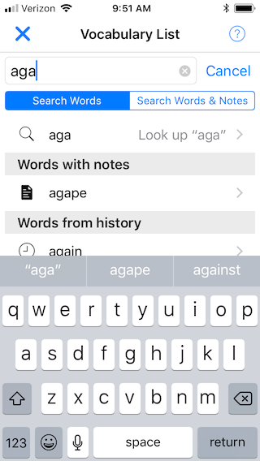
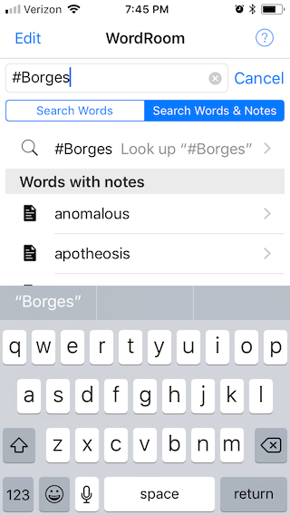
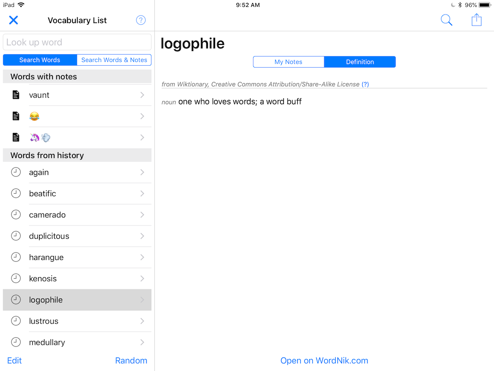

# WordRoom 
A personal dictionary app written with Pythonista for iOS

## Introduction

A while ago, I wanted an app that would let me write my own personal dictionary. None of the other apps on the market did exactly what I had in mind, so I created my own. 

You can think of this as a cross between a dictionary app and a notes app. Every time you look up a word, you are given a textbox where you can write whatever you want about it. All of your words with notes are stored so you can access them later. If you open a word again, then your notes will be the first thing you see. The dictionary definition is secondary.

## Why?

Personally, I started jotting down interesting words a while ago, but I wanted to remember more than just their definitions. I started taking notes on where I had heard the word, any interesting contexts, the time period when it was written, and so on. 

But I can imagine that this app could have pratical uses beyond the curiosity of a logophile. A fantasy writer could keep track of words in a fictional world. A student could study terminology.

There are many excellent dictionary apps available today, and it's not my intention to reinvent their good work. I'm particularly fond of [Terminology](https://agiletortoise.com/terminology/). I've designed WordRoom to be more of a companion to other apps rather than a replacement.

  

## Installation

1. Download [Pythonista](http://omz-software.com/pythonista/) for iOS. 
2. Download the latest release of WordRoom to Pythonista. You can easily install it by copying and pasting this line of code into your Pythonista console:
```
import requests as r; exec(r.get('https://bit.ly/2tFpuZh').text)
```
3. Run `WordRoom.py` in the WordRoom directory.

## Tips

WordRoom includes a basic offline dictionary [from this repository](https://github.com/johnridesabike/OPTED-to-JSON). To get access to the complete online definitions, you'll need [WordNik API Key](https://developer.wordnik.com), which is free for personal use. Once you have one, follow the instructions in WordRoom.

To keep the code light, I haven't written any features like tags, categories, or favorites. If you want a better way of organizing your words, you can take advantage of the search feature. It will recognize #HashTags in your notes.

## Contributing

If you think this app is useful and you want to make it better, feel free to open an issue or a pull request. I'm open to suggestions for new features.

There is probably a lot of code that could be improved. I made most decisions based on what was easy for me to do at the time. If you have any questions about the code, [please get in touch](https://johnridesa.bike/contact/).

## License

Copyright 2018 John Jackson

Licensed under the MIT License. See the included LICENSE file for details.
