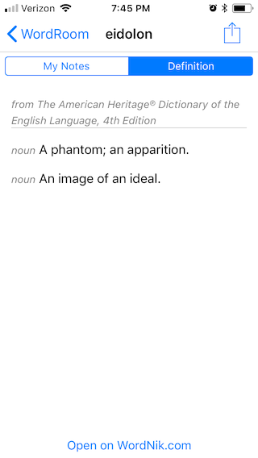

# WordRoom 
A personal dictionary app written with Pythonista for iOS

## Introduction

A while ago, I wanted an app that would let me write my own personal dictionary. None of the other apps on the market did exactly what I had in mind, so I created my own. 

You can think of this as a cross between a dictionary app and a notes app. Every time you look up a word, you are given a textbox where you can write whatever you want about it. All of your words with notes are stored so you can access them later. If you open a word again, then your notes will be the first thing you see. The dictionary definition is secondary.

### Why?

Personally, I started jotting down interesting words a while ago, but I wanted to remember more than just their definitions. I started taking notes on where I had heard the word, any interesting contexts, the time period when it was written, and so on. 

But I can imagine that this app could have pratical uses beyond the curiosity of a logophile. A fantasy writer could keep track of words in a fictional world. A student could study terminology.

There are many excellent dictionary apps available today, and it's not my intention to reinvent their good work. I'm particularly fond of [Terminology](https://agiletortoise.com/terminology/). I've designed WordRoom to be more of a companion to other apps rather than a replacement.

   

## Installation

1. Download [Pythonista](http://omz-software.com/pythonista/) for iOS. 
2. Clone this repository to Pythonista. If you have a Mac or PC nearby, the easiest way of doing this is cloning a copy on those and copying it to the Pythonista iCloud folder. You can also use tools like [this script](https://github.com/cclauss/Ten-lines-or-less/blob/master/read_zipfile_from_github.py) without needing to leave your iOS device.
3. Obtain a [WordNik API Key](https://developer.wordnik.com). It's free for personal use. Once you have one, you'll need to follow the instructions in `apikey-sample.py` to plug it into the code.
4. Download [Python 3 client for Wordnik.com API](https://github.com/wordnik/wordnik-python3).
5. Run `main.py` in the WordRoom folder.

### Tips

To keep the code light, I haven't written any features like tags, categories, or favorites. If you want a better way of organizing your words, you can take advantage of the search feature. It will recognize #HashTags in your notes.

## Possible future features

- Application extension and widget (There's currently a Pythonista iCloud bug affecting this.)
- Performance optimizations
- User-editable categories
- Flash-card mode
- Dictionary sources different than WordNik
- Standalone application
- Cross-platform application

